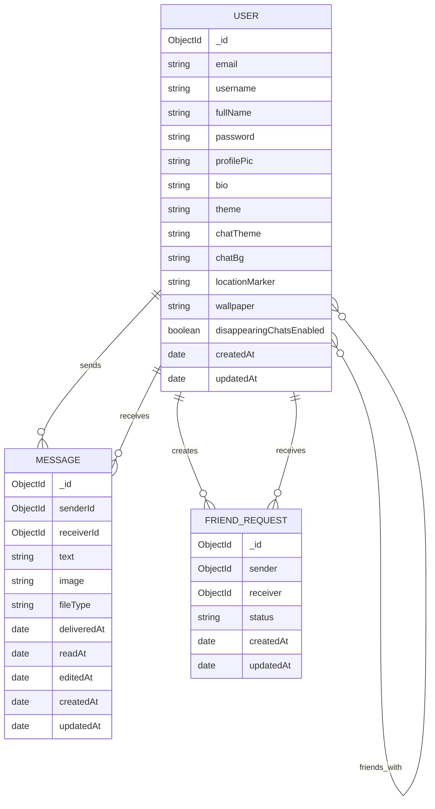

# Chatify ER Diagram

This document captures the main database entities used in the Chatify project and includes the SESD submission reminder details for documentation completeness.

## ER Diagram

## Entity Notes

### `User`

- Stores authentication details, public profile data, appearance settings, and social graph references.
- `friends` is a self-referencing many-to-many relationship stored as an array of `User` ids.
- `disappearingChatsEnabled` controls whether the user's chats are removed after they go offline.

### `Message`

- Represents a chat message sent from one user to another.
- Each message belongs to exactly one sender and one receiver.
- A message may contain text, an uploaded image, or file metadata.
- Delivery lifecycle is tracked with `deliveredAt`, `readAt`, and `editedAt`.

### `FriendRequest`

- Represents a request between two users before they become contacts.
- `status` can be `pending`, `accepted`, or `declined`.
- A unique compound index prevents duplicate requests between the same sender and receiver pair.

## Relationship Summary

- One `User` can send many `Message` records.
- One `User` can receive many `Message` records.
- One `User` can create many `FriendRequest` records.
- One `User` can receive many `FriendRequest` records.
- `User` to `User` friendship is many-to-many through the `friends` array.
